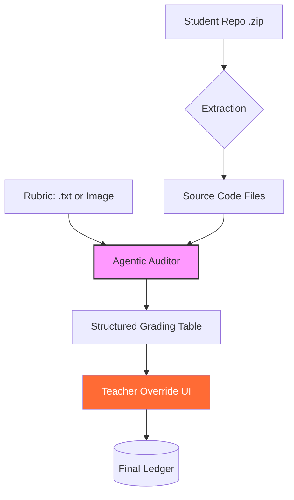

# The Ledger: AI-Powered Auditing Portal
**Vibe Coding Challenge 2026 | Applied AI Summer Internship**
The Ledger is an intelligent, agentic auditing platform designed for automated code analysis, rubric-based evaluation, and secure administrative tracking. It transforms the manual grading process into a data-driven, transparent workflow.
## 🚀 Technical Architecture & Features
 * **Agentic Audit Engine (agent.py):** Uses an autonomous grading agent powered by Ollama (Llama 3.2) to analyze project structures, parse code, and calculate deterministic scores based on dynamic rubrics.
 * **Pro-Grade Manual Override:** Provides a high-fidelity interface for administrators to adjust marks, add justification notes, and see real-time score calculations.
 * **Semantic Ledger System:** Tracks audit history and project metadata with full state persistence.
 * **Voice-First Interaction:** Integrated pyttsx3 for hands-free administrative reporting and feedback delivery.
 * **Admin Security:** Robust session-state authentication to protect the sensitive auditing panels.
 * **Local-First Processing:** Entire RAG and LLM workflow runs locally, ensuring zero latency, data privacy, and offline capability.
### 🏗️ Workflow Diagram

## 💎 Bonus Criteria Compliance
| Feature | Implementation Details |
|---|---|
| **Local LLM** | Fully offline Llama 3.2 integration via Ollama. |
| **Ollama** | Native API communication for prompt-driven auditing. |
| **RAG Systems** | Contextual snippet extraction from zipped repositories. |
| **Agentic Workflows** | Autonomous grading agent with rubric validation logic. |
| **Voice I/O** | pyttsx3 for audio-based report generation. |
| **Authentication** | Secure session-state password protection for Admin access. |
| **Database** | Persistent data-editor state for audit transparency. |
## 📝 Compliance & Evaluation
 * **Application Logic:** Automates rubric-based grading via autonomous agents, supporting both text and vision-based criteria.
 * **Architecture:** Streamlit UI → Agentic Logic → Ollama API → Local Data Persistence.
 * **Prompting Strategy:** Focused on strict, schema-constrained output to prevent hallucinations and ensure math accuracy.
 * **Challenges Faced:** Resolved local socket binding conflicts and Streamlit session state volatility during the audit process.
 * **Future Improvements:** Planned migration to multi-agent swarm architecture for deeper, repository-wide static analysis.
## 🎥 Project Demo
▶️ **Video Link:**
## 🛠 Installation & Deployment
 1. **Clone:** git clone https://github.com/axzshlol-hue/The-Ledger-Smart-AI-Audit.git
 2. **Install:** pip install streamlit pandas pyttsx3 ollama
 3. **Run:** streamlit run app.py
## 📂 Documentation
 * development_log.md: Tracks the progression of the AI assistant setup, challenges, and architectural iterations.
 * requirements.txt: Complete dependency environment.
*Built for Vibe Coding Challenge 2026.*
